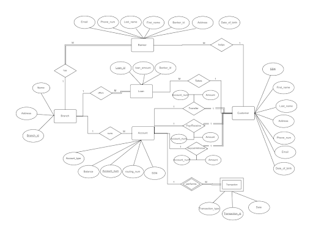

# Bank Database Project

## Overview
This project designs and implements a relational database for a bank, capturing key entities such as branches, customers, bankers, loans, accounts, transactions, and more. The design follows 3NF principles and includes comprehensive SQL queries for data manipulation and analysis. Our work highlights the design decisions, normalization, and querying techniques developed during this project.

## Key Features
- **Comprehensive Schema:** Covers branches, customers, bankers, loans, accounts, transactions, and transfers.
- **Logical Database Design:** Combined related entities for a streamlined and effective relational model.
- **Advanced SQL Queries:** Utilizes `GROUP BY`, `HAVING`, and nested queries for real-world data insights. check out [SQL Queries](SQL_Queries.pdf)
 for all the queries.
- **Collaborative Development:** Successfully implemented by a dedicated team, leveraging individual strengths.

## Screenshots
<!-- Replace with your actual image paths -->

 

## Conclusion
Our group successfully designed a scalable and normalized bank database system while overcoming challenges in SQL implementation and collaboration. This project provided valuable insights into real-world database management and design, setting a strong foundation for future work in this area.

## Team Members
- **Sai Vishal Chinta** 
- **Mahmoud Saad** 
- **Krish Bedi** 
